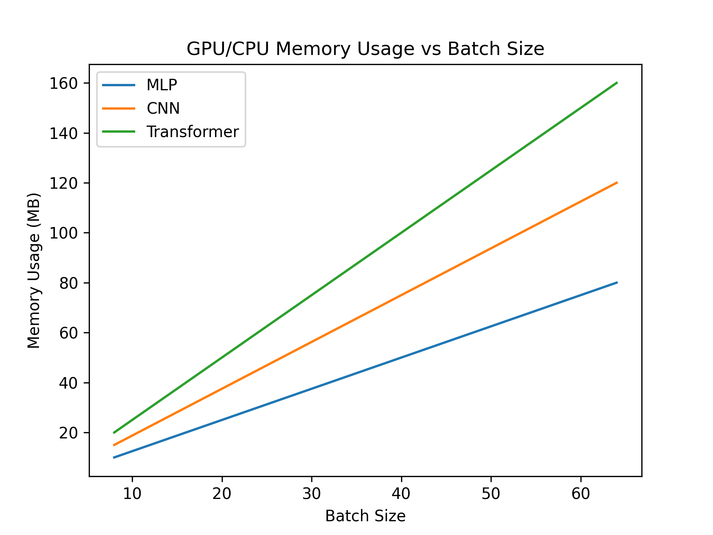

# Neural Network GPU/CPU Profiling

[](https://www.python.org/)
[](https://pytorch.org/)
[](LICENSE)

This repository demonstrates **profiling memory and compute usage** of different neural network architectures (MLP, CNN, Transformer block) using **PyTorch**. It is designed to run on **Mac MPS** (Apple Silicon) or CPU.

---

## Features

- Implements three architectures:
  - **MLP** (Multi-Layer Perceptron)
  - **Simple CNN**
  - **Transformer Block**
- Generates **synthetic data** with varying batch sizes
- Profiles **CPU time** and **GPU memory usage** (via MPS memory allocation)
- Saves **memory and compute plots** to `results/` folder

---

## Setup

1. **Clone the repository**

```bash
git clone https://github.com/yourusername/NN-Profiling.git
cd NN-Profiling
```

2. **Create a virtual environment and install dependencies**
```bash
python3 -m venv venv
source venv/bin/activate
pip install torch torchvision matplotlib
```
3. Ensure results/ folder exists
```bash
mkdir -p results
```
## Usage
- Run the profiling script:
```bash
python profile.py
```

- The script will:
   - Generate synthetic data for each model
   - Profile forward passes with increasing batch sizes
   - Print per-layer CPU timing
   - Print MPS memory usage
   - Save plots of memory vs batch size to results/memory_vs_batch.png


## File Structure
```bash
NN-Profiling/
├─ models.py        # MLP, CNN, TransformerBlock implementations
├─ data.py          # Synthetic data generator
├─ profile.py       # Profiling script (CPU/MPS + memory)
├─ results/         # Saved memory/compute plots
└─ README.md
```


## Output
Memory Usage Plot:


| Layer        | Self CPU Time (ms) |
|:------------ | ----------------:|
| Linear       | 0.807            |
| ReLU         | 2.630            |
| MultiheadAttn| 4.780            |

Actual numbers will vary depending on batch size and machine.

**Notes**
Mac MPS Limitation: PyTorch profiler currently does not support MPS activity directly, so profiling only tracks CPU time. GPU memory is tracked with torch.mps.memory_allocated() and torch.mps.max_memory_allocated().

Adjust batch size: Modify batch_sizes in profile.py to experiment with different loads.
Extending to CUDA: On NVIDIA GPUs, change the device to cuda and set profiler activities to [ProfilerActivity.CPU, ProfilerActivity.CUDA].


## License
This project is MIT Licensed. Feel free to use and modify for research or learning purposes.